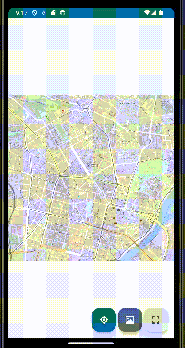

# About
This repository consists of modules which are Android client and web server. Applications communicate via SOAP. The server provides endpoints for cropping images of a map. On the other hand, the client provides a presentation layer and allows for image cropping via form submission or drawing rectangle on the image. More details in corresponding repositories.

# Credits
Provided static map image is from [OpenStreetMap](https://www.openstreetmap.org/).
OpenStreetMap data is available under the Open Database License (ODbL).
You can read more about copyrights [here](https://www.openstreetmap.org/copyright/en).